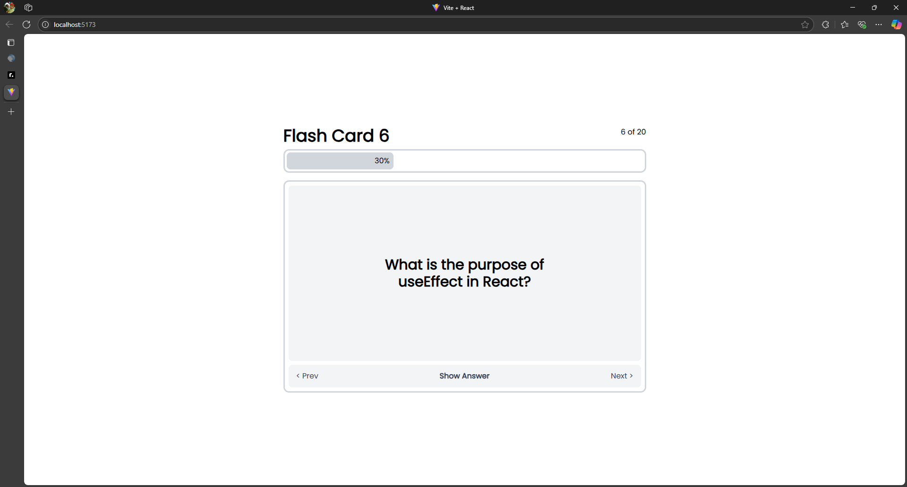
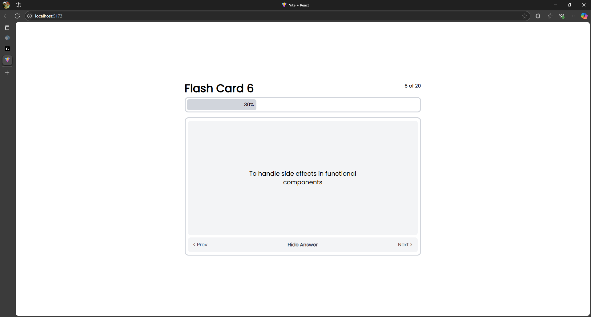

# GoGrow Flash Card

GoGrow Flash Card was built with JavaScript and Tailwind CSS using the Vite React framework. The cards display questions and answers to introduce basic concepts like JavaScript, React, and more.

## ✨ Features

- Show or hide questions and answers when the button is clicked
- Next and Previous buttons for navigating through questions
- Progress bar to indicate the current question number

## 🖼️ Preview




## 🛠️ Technologies Used

- JavaScript
- Tailwind CSS
- Vite
- React  

## 🚀 How to Run

### 1. Clone the Repository
```bash	
git clone https://github.com/alghifrz/GoGrow-flash-card.git
cd GoGrow-flash-card
```	
### 2. Install Dependencies
```bash
npm install
```
### 3. Run the Application
```bash
npm run dev
```

## 📝 License

This project is licensed under the [MIT License](https://github.com/alghifrz/GoGrow-flash-card/blob/main/LICENSE).

## Made with ❤️ by Alghifari Rasyid Zola
```vbnet
Let me know if you want this localized to Indonesian again or want to add preview images or video demos!
```